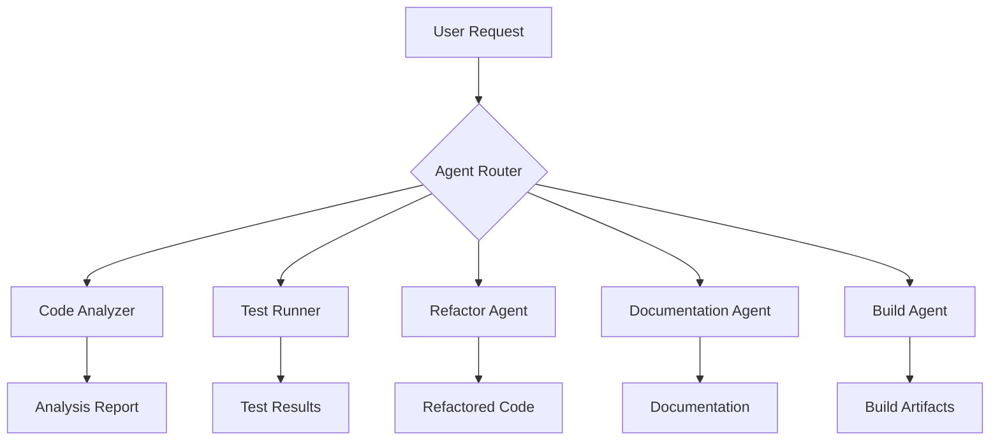

# Agents.md

## Judgment Boundaries
**NEVER**
- Commit secrets, tokens, or `.env` files
- Add external dependencies without discussion
- Use `_` to ignore errors

**ASK**
- Before adding external dependencies
- Before running database migrations

**ALWAYS**
- Explain your plan before writing code
- Commit changes in small minimal commits, using conventional commits format
- Sign commits with gpg. If the key is locked, ask user to open it

## Available Agents

### 1. **Code Analyzer**
**Purpose**: Analyze code structure, dependencies, and patterns
**Capabilities**:
- Static code analysis
- Dependency mapping
- Architecture visualization
- Test coverage analysis

### 2. **Test Runner**
**Purpose**: Execute and manage test suites
**Capabilities**:
- Unit test execution (Vitest)
- E2E test execution (Playwright)
- Test result analysis
- Coverage reporting

### 3. **Refactor Agent**
**Purpose**: Safe code refactoring and optimization
**Capabilities**:
- Type-safe refactoring
- Component extraction
- Dependency updates
- Performance optimization

### 4. **Documentation Agent**
**Purpose**: Generate and maintain documentation
**Capabilities**:
- API documentation
- Component documentation
- Architecture diagrams
- README generation

### 5. **Build Agent**
**Purpose**: Manage build processes and deployments
**Capabilities**:
- Build optimization
- Deployment pipelines
- CI/CD integration
- Asset optimization

## Workflow Integration

## Usage Patterns

1. **Analysis First**: Always start with Code Analyzer
2. **Test-Driven**: Run tests before and after changes
3. **Incremental**: Small, verifiable changes
4. **Documented**: Generate docs for all changes
5. **Reviewed**: Human review before merge
