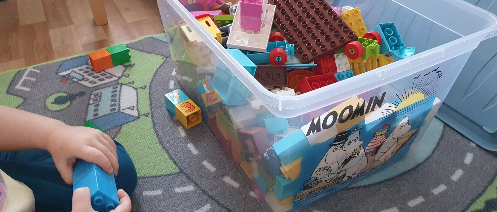

import ExternalLink from '../../../../../components/ExternalLink'
import Link from '../../../../../components/Link'

Kotihoidon tuen kuntalisä, eli niin sanottu Kirkkonummi-lisä, on kunnalle vapaaehtoinen maksu, jota se voi maksaa kotihoidossa olevista lapsista. Samalla kun isot kaupungit <ExternalLink href="https://yle.fi/uutiset/3-11640872">pienentävät kuntalisiään</ExternalLink> ja <ExternalLink href="https://www.hs.fi/kotimaa/art-2000007729001.html">kotihoidon tuen lopettamisesta kokonaisuudessaan puhutaan</ExternalLink>, päätti Kirkkonummen kunnanvaltuusto <ExternalLink href="https://www.kirkkonummi.fi/kotihoidon-tuen-kuntalisa-182019-alkaen">lopettaa sen meiltä kokonaan</ExternalLink>. <ExternalLink href="https://www.kela.fi/ajankohtaista-henkiloasiakkaat/-/asset_publisher/kg5xtoqDw6Wf/content/kotihoidon-tukeminen-myohentaa-aitien-tyohon-siirtymista">Kelan oman tutkimuksen mukaan</ExternalLink> paras ratkaisu olisi pidentää vanhempainvapaita ja <ExternalLink href="https://www.vihreat.fi/ajankohtaista/vihdoin-tasa-arvoinen-perhevapaauudistus/">hallituskin on lähtenyt perhevapaita uudistamaan</ExternalLink>, mutta tähän eivät yksittäiset kunnat voi vaikuttaa. Sen takia Kirkkonummelle pitäisikin palauttaa kuntalisä alle 2-vuotiaille lapsille, sillä siitä hyötyvät niin <Link href="#lapset">lapset</Link>, <Link href="#vanhemmat">vanhemmat</Link>, <Link href="#paivakotien-tyontekijat">päiväkotien työntekijät</Link>, <Link href="#kirkkonummelaiset">muut kirkkonummelaiset</Link> kuin <Link href="#kunnan-paattajat">kunnan päättäjätkin</Link>.

## Lapset

Kirkkonummi-lisän avulla lapsi saa olla kotona elämänsä <ExternalLink href="https://www.mll.fi/vanhemmille/lapsen-kasvu-ja-kehitys/0-1-v/">vaiheet</ExternalLink>, jolloin hän <ExternalLink href="https://www.mll.fi/vanhemmille/lapsen-kasvu-ja-kehitys/1-2-v/">tarvitsee</ExternalLink> eniten huomiota ja huolenpitoa. Noin 11 ja puolen kuukauden iässä kun vanhempainvapaa loppuu, <ExternalLink href="https://www.mll.fi/vanhemmille/lapsen-kasvu-ja-kehitys/0-1-v/vauvan-liikunnallinen-kehitys/">useimmat lapset osaavat kontata ja ehkä jopa seistä tukea vasten</ExternalLink>. Myös <ExternalLink href="https://www.is.fi/perhe/art-2000000926258.html">eroahdistus</ExternalLink> on ajankohtainen. Vasta vuoden ikäisenä lapsi puhuu <ExternalLink href="https://www.mll.fi/vanhemmille/lapsen-kasvu-ja-kehitys/1-2-v/1-2-vuotiaan-alyllinen-kehitys/">ensimmäiset sanansa</ExternalLink> ja alkaa myös <ExternalLink href="https://www.mll.fi/vanhemmille/lapsen-kasvu-ja-kehitys/1-2-v/1-2-vuotiaan-liikunnallinen-kehitys/">pikkuhiljaa kävelemään</ExternalLink>. Lapsi alkaa myös osoittamaan <ExternalLink href="https://www.mll.fi/vanhemmille/lapsen-kasvu-ja-kehitys/1-2-v/1-2-vuotiaan-persoonallisuuden-kehitys/">omaa temperamenttiaan</ExternalLink>, jolloin on hyvä, että hyvin lapsen tunteva vanhempi on läsnä purkamassa tilanteita. Lapsi ei vielä myöskään <ExternalLink href="https://www.mll.fi/vanhemmille/lapsen-kasvu-ja-kehitys/1-2-v/1-2-vuotiaan-sosiaalinen-kehitys/">osaa leikkiä toisten lasten kanssa</ExternalLink>.

2 vuotta täyttänyt lapsi on jo <ExternalLink href="https://www.mll.fi/vanhemmille/lapsen-kasvu-ja-kehitys/2-3-v/">aivan erilainen yksilö</ExternalLink>. Tässä vaiheessa lapsi osaa jo <ExternalLink href="https://www.mll.fi/vanhemmille/lapsen-kasvu-ja-kehitys/2-3-v/2-3-vuotiaan-sosiaalinen-kehitys/">huomioida ympärillään olevia</ExternalLink>, <ExternalLink href="https://www.mll.fi/vanhemmille/lapsen-kasvu-ja-kehitys/2-3-v/2-3-vuotiaan-alyllinen-kehitys/">lapsi ymmärtää ohjeita ja alkaa oppia erilaisia asioita</ExternalLink>. Toki tässä iässä myös <ExternalLink href="https://www.mll.fi/vanhemmille/lapsen-kasvu-ja-kehitys/2-3-v/2-3-vuotiaan-persoonallisuuden-kehitys/">tahtominen</ExternalLink> on usein ajankohtaista, mutta toisaalta <ExternalLink href="https://mielenihmeet.fi/lasten-rutiinien-tarkeys/">rutiinit auttavat tähän hyvin</ExternalLink> ja päiväkodissa niitä riittää.

## Vanhemmat

Taloudellisesti 150 euroa kuukaudessa on iso raha kotihoidon tuen [342,95 euron](https://www.kela.fi/kotihoidontuki-maara-ja-maksaminen) päälle. Esimerkiksi yhdellä pienellä lapsella ja aikuisella menee ruokaan kuukaudessa arviolta <ExternalLink href="https://www.mtvuutiset.fi/makuja/artikkeli/paljonko-teilla-kuluu-rahaa-ruokaan-kuukaudessa-vertaa-tahan-rahasummaan-yksinelavan-parin-lapsiperheen-teiniperheen-ja-muiden-budjetit/7948114">341 euroa</ExternalLink>. Pelkästä kotihoidon tuesta ei siis paljoa jää kuukaudessa käteen. Kirkkonummi-lisällä ostatkin päälle vaikka talvivaatteet lapselle.

Jokaisella vanhemmalla pitäisi olla mahdollisuus päästä nauttimaan lapsensa kehityksestä, varsinkin ensimmäisten vuosien aikana, jolloin lapsi oppii melkein päivittäin jotain uutta. Toivottavasti <ExternalLink href="https://www.eduskunta.fi/FI/naineduskuntatoimii/kirjasto/aineistot/kotimainen_oikeus/LATI/Sivut/perhevapaauudistus.aspx">perhevapaauudistus</ExternalLink> tuo tähän helpotusta, mutta niin kauan kuin mennään nykyisellä mallilla, pystyy Kirkkonummi auttamaan vanhempia kuntalisällä.

## Päiväkotien työntekijät

Yhdellä hoitajalla voi olla ryhmässään <ExternalLink href="https://www.finlex.fi/fi/laki/alkup/2018/20180753">enintään neljä alle 3-vuotiasta lasta</ExternalLink>. Jo <ExternalLink href="https://yle.fi/uutiset/3-10633334">nyt</ExternalLink> on <ExternalLink href="https://www.hs.fi/kaupunki/art-2000007635404.html">pääkaupunkiseudulla</ExternalLink> pulaa <ExternalLink href="https://www.iltalehti.fi/kotimaa/a/3dc1a617-48cf-46e1-8e83-05f2395c7af8">päiväkotien</ExternalLink> työntekijöistä ja <ExternalLink href="https://www.is.fi/kotimaa/art-2000006352887.html">nykyisillä</ExternalLink> työntekijöillä on kasvavia paineita lasten hoidossa. Kirkkonummen kunnallakin on kirjoitushetkellä [6 avointa työpaikkaa päiväkodeissa](https://www.kuntarekry.fi/fi/tyopaikat/?&profession=38816&type=53258&organisation=9&lang=fi_FI&sort=%22-changetime%22&limit=24&display=grid).

Jos useampi alle 2-vuotias siirtyy kotihoidosta varhaiskasvatuksen piiriin, on päiväkodeissa kädet varmasti täynnä. Vaikka tilat olisivat kuinka turvallisia tahansa, on neljästä <ExternalLink href="https://www.mll.fi/vanhemmille/lapsen-kasvu-ja-kehitys/0-1-v/vauvan-liikunnallinen-kehitys/">konttaavasta</ExternalLink> ja <ExternalLink href="https://www.mll.fi/vanhemmille/lapsen-kasvu-ja-kehitys/0-1-v/vauvan-sosiaalinen-kehitys/">jokeltavasta</ExternalLink> lapsesta huolehtiminen haastavaa kenelle tahansa. Jos sen sijaan lapsia hoidetaan kotona kahteen ikävuoteen asti, eivät he enää <ExternalLink href="https://www.mll.fi/vanhemmille/lapsen-kasvu-ja-kehitys/2-3-v/2-3-vuotiaan-liikunnallinen-kehitys/">kaatuile jatkuvasti</ExternalLink>, heidän kanssaan voi <ExternalLink href="https://www.mll.fi/vanhemmille/lapsen-kasvu-ja-kehitys/2-3-v/2-3-vuotiaan-sosiaalinen-kehitys/">leikkiä järjestelmällisemmin</ExternalLink> ja he osaavat <ExternalLink href="https://www.mll.fi/vanhemmille/lapsen-kasvu-ja-kehitys/1-2-v/1-2-vuotiaan-alyllinen-kehitys/">todennäköisesti ilmaista itseään</ExternalLink>.

## Kirkkonummelaiset

Vaikka et itse saakaan Kirkkonummi-lisää, siitä on sinullekin etua. Manner-Suomessa on jäljellä enää <ExternalLink href="https://www.kuntaliitto.fi/sites/default/files/media/file/Kotihoidontuen-kuntalisat-2020.pdf#page=7">55 kuntaa</ExternalLink>, jotka kuntalisää maksavat, joten kyseessä on oikein hyvä houkutin lapsiperheille. Kun kuntaan sitten saadaan lisää veronmaksajia, voidaan muitakin palveluita parantaa ja laajentaa, nimenomaan niitä, joita sinä käytät.

Muutenkin aikana jolloin <ExternalLink href="https://www.stat.fi/til/synt/2019/02/synt_2019_02_2020-12-04_tie_001_fi.html">syntyvyys</ExternalLink> on <ExternalLink href="https://yle.fi/uutiset/3-11680904">laskussa</ExternalLink>, ovat lapsiperheet kunnille entistäkin tärkeämpiä palveluiden varmistamiseksi. Kun keskimäärin lapsia saavat <ExternalLink href="http://www.stat.fi/tup/tilastokirjasto/aidit_tilastoissa_2018.html">30-40-vuotiaat</ExternalLink>, ja eläkkeelle siirrytään <ExternalLink href="https://www.tyoelake.fi/elakkeet-eri-elamantilanteissa/vanhuuselake-ikaluokilla-oma-elakeikansa/">yli 60-vuotiaina</ExternalLink>, jää vanhemmille monta kymmentä vuotta aikaa tuottaa kunnalle verotuloja, joilla palveluita maksetaan. Varsinkin koronan aiheuttaman kriisin aikana yhä useampi on muuttanut pois <ExternalLink href="https://www.hs.fi/kotimaa/art-2000007647867.html">Helsingistä</ExternalLink> ja <ExternalLink href="https://www.lansivayla.fi/paikalliset/3129350">pääkaupunkiseudulta</ExternalLink>, pitäisi Kirkkonummen houkutella näitä samoja ihmisiä muuttamaan nimenomaan Kirkkonummelle.

## Kunnan päättäjät

_Varoitus: seuraavassa osiossa on paljon numeroita._

Kirkkonummi-lisän lopettamisessa oli tietenkin kyse siitä, että jostain piti leikata, jotta budjetti saadaan tasapainoon. Todennäköisesti on käyty läpi, että Kirkkonummi-lisä maksaa kunnalle yli 360 000 € vuodessa (jos tuen saajia on yli 200). Ehkä on myös ajateltu, ettei kotihoidon tuen kuntalisä vaikuta varhaiskasvatuksen kysyntään, <ExternalLink href="https://www.kuntaliitto.fi/sites/default/files/media/file/Kotihoidontuen-kuntalisat-2020.pdf#page=8">vaikka se ei ole välttämättä totta</ExternalLink>.

Kuitenkin jokainen lapsi joka siirtyy tämän seurauksena päiväkotiin, maksaa kunnalle keskimäärin 672,85 euroa (palvelusetelin maksimihinnan ollessa <ExternalLink href="https://www.kirkkonummi.fi/library/files/5c923621c91058d1e40005b4/Kn_s__nt_kirja_svl__1.8.2019.pdf#page=9">1 293 euroa</ExternalLink> ja vanhemman maksaessa <ExternalLink href="https://www.kirkkonummi.fi/tietoa-taloudesta">tuloveroa</ExternalLink> kunnalle [620,15 euroa](https://www.tilastokeskus.fi/tup/suoluk/suoluk_palkat.html)) kuukausitasolla. Vuositasolla riittää, että 45 lasta siirtyy kotihoidosta varhaiskasvatukseen, jotta kunta menettää saman 360 000 € vuodessa.

Kirkkonummi-lisä on toki myös hyvä markkinoinnin apuväline, sillä <ExternalLink href="https://www.kuntaliitto.fi/sites/default/files/media/file/Kotihoidontuen-kuntalisat-2020.pdf#page=7">vain harva kunta sitä enää maksaa</ExternalLink>. Jos sillä saadaan houkuteltua yksikin lapsiperhe Kirkkonummelle esimerkiksi Keravan sijaan, saadaan kunnalle <ExternalLink href="https://www.kirkkonummi.fi/tietoa-taloudesta">verotuloja</ExternalLink> [7 441,80](https://www.tilastokeskus.fi/tup/suoluk/suoluk_palkat.html) euroa vuodessa, niin kauan kun vain yksi vanhemmista käy töissä. Mikäli molemmat vanhemmat siirtyvät jossain vaiheessa takaisin työelämään, maksavat he vuosittain keskimäärin [14 883,60 euroa](https://www.tilastokeskus.fi/tup/suoluk/suoluk_palkat.html) <ExternalLink href="https://www.kirkkonummi.fi/tietoa-taloudesta">tuloveroa</ExternalLink>.

## Summa summarum

Välitön hyöty kotihoidon tuen kuntalisästä on tietenkin sitä saaville perheille. 150 euroa kuukaudessa voi tuntua monesta pieneltä rahalta, mutta pienituloisessa perheessä sillä on suuri merkitys. Pelkästään heikoimmassa asemassa olevista huolehtimisen pitäisi riittää perusteeksi sen palauttamiseen.

Välillisesti Kirkkonummi-lisästä ja muistakin lapsiperheiden palveluista hyötyvät kuitenkin myös koko kunta. Lapsiperheiden houkutteleminen kuntaan on yksi parhaista tavoista saada kunnan taloutta parannettua pitkällä aikavälillä ja kuntalisä on siihen hyvä houkutin.
